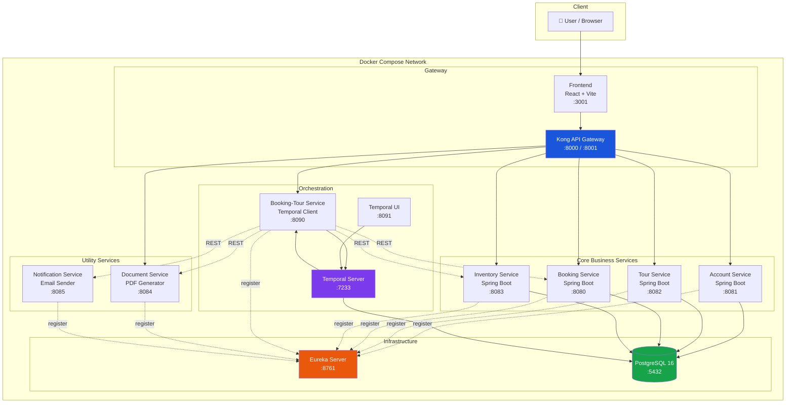
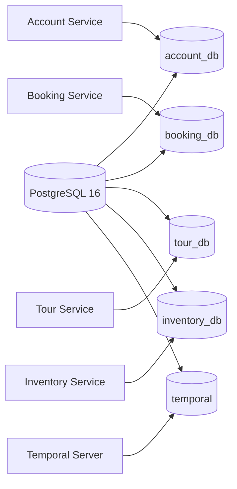

# System Architecture

> This document is completed **after** [Analysis and Design](analysis-and-design.md).
> Based on the Service Candidates and Non-Functional Requirements identified there, select appropriate architecture patterns and design the deployment architecture.

**References:**
1. *Service-Oriented Architecture: Analysis and Design for Services and Microservices* — Thomas Erl (2nd Edition)
2. *Microservices Patterns: With Examples in Java* — Chris Richardson
3. *Bài tập — Phát triển phần mềm hướng dịch vụ* — Hung Dang (available in Vietnamese)

---

## 1. Pattern Selection

Select patterns based on business/technical justifications from your analysis.

| Pattern | Selected? | Business/Technical Justification |
|---------|-----------|----------------------------------|
| API Gateway | ✅ | Kong API Gateway — single entry point cho tất cả client requests. Xử lý CORS, JWT authentication, rate limiting. Declarative config (kong.yml) không cần code. |
| Database per Service | ✅ | Mỗi service có database riêng (booking_db, account_db, tour_db, inventory_db) → loose coupling, cho phép scale và evolve schema độc lập. |
| Shared Database | ❌ | Không sử dụng — vi phạm nguyên tắc autonomy của microservices. |
| Saga (Orchestration) | ✅ | Sử dụng Temporal.io để orchestrate toàn bộ luồng đặt tour. Booking-Tour Service điều phối: validate → booking → block slot → payment → confirm → notify. Hỗ trợ compensation (rollback) khi có lỗi. |
| Event-driven / Message Queue | ⚠️ Planned | Kafka + Debezium (Outbox pattern) đã được cấu hình trong docker-compose (hiện tại đang tắt). OutboxEntity đã có trong Booking & Inventory service, sẵn sàng kích hoạt. |
| CQRS | ❌ | Chưa áp dụng — quy mô hiện tại chưa cần tách read/write model. |
| Circuit Breaker | ❌ | Chưa triển khai — Temporal retry đã đảm bảo fault tolerance cơ bản. |
| Service Registry / Discovery | ✅ | Netflix Eureka — tất cả Spring Boot services đăng ký với Eureka Server. Kong có thể resolve service names qua Docker network hoặc Eureka plugin. |
| Optimistic Locking | ✅ | Inventory entity sử dụng `@Version` để chống overbooking khi nhiều request đồng thời block slot trên cùng tour schedule. |
| Saga Compensation | ✅ | Temporal Saga object quản lý rollback — khi activity fail, các bước trước đó được hoàn tác (compensate). |

> Reference: *Microservices Patterns* — Chris Richardson, chapters on decomposition, data management, and communication patterns.

---

## 2. System Components

| Component | Responsibility | Tech Stack | Port |
|-----------|----------------|------------|------|
| **Frontend** | Giao diện đặt tour: tìm kiếm, xem chi tiết, đặt chỗ, thanh toán | React + Vite | 3001 (host) → 3000 (container) |
| **Kong API Gateway** | Routing, CORS, JWT auth, rate limiting | Kong 3.x (Declarative Mode) | 8000 (proxy), 8001 (admin) |
| **Account Service** | Đăng ký, đăng nhập, quản lý JWT token | Spring Boot 3, Spring Security, JPA | 8081 |
| **Tour Service** | Quản lý tour, tìm kiếm, xem chi tiết + lịch trình | Spring Boot 3, JPA, Auditing | 8082 |
| **Booking Service** | Quản lý đơn đặt tour, hành khách, dịch vụ tùy chọn, thanh toán | Spring Boot 3, JPA | 8080 |
| **Inventory Service** | Quản lý tồn kho (available/blocked/confirmed slots), slot block lifecycle | Spring Boot 3, JPA, Liquibase, Quartz | 8083 |
| **Booking-Tour Service** | Orchestrate booking workflow bằng Temporal (Saga pattern) | Spring Boot 3, Temporal SDK | 8090 |
| **Document Service** | Render booking ticket PDF từ HTML template | Spring Boot 3, Flying Saucer (PDF) | 8084 |
| **Notification Service** | Gửi email xác nhận đặt tour (SMTP) | Spring Boot 3, JavaMailSender, Thymeleaf | 8085 |
| **Eureka Server** | Service Registry / Discovery | Spring Boot 3, Netflix Eureka Server | 8761 |
| **Temporal Server** | Workflow engine — đảm bảo durability, retry, compensation | Temporal 1.23.1 (Auto-setup) | 7233 |
| **Temporal UI** | Dashboard quản lý và giám sát workflows | Temporal UI 2.21.3 | 8091 |
| **PostgreSQL** | Database chung — tách logical databases | PostgreSQL 16 Alpine | 5432 |

---

## 3. Communication

### Inter-service Communication Matrix

| From → To | Account Service | Tour Service | Booking Service | Inventory Service | Booking-Tour Service | Document Service | Notification Service | Kong Gateway | Eureka |
|-----------|:-:|:-:|:-:|:-:|:-:|:-:|:-:|:-:|:-:|
| **Frontend** | — | — | — | — | — | — | — | REST | — |
| **Kong Gateway** | REST | REST | REST | REST | REST | REST | — | — | — |
| **Booking-Tour** | — | — | REST (internal) | REST (internal) | — | REST (internal) | REST (internal) | — | Eureka |
| **Inventory** | — | — | — | — | — | — | REST (internal) | — | Eureka |
| **All Services** | — | — | — | — | — | — | — | — | Register |

**Communication protocols:**
- **Frontend → Kong**: REST over HTTP (port 8000)
- **Kong → Services**: REST (Kong proxies dựa trên route paths trong kong.yml)
- **Booking-Tour → Other Services**: REST (inter-service calls qua Temporal Activities, dùng Eureka service names)
- **All Services → Eureka**: Service registration & heartbeat
- **Temporal Server → Booking-Tour**: gRPC (task queue polling)

---

## 4. Architecture Diagram

### Database Separation

---

## 5. Deployment

- All services containerized with Docker (multi-stage build: Maven build → JRE runtime)
- Orchestrated via Docker Compose (`docker-compose.yml`)
- Single command: `docker compose up --build`
- Environment variables managed via `.env` file
- Database initialization via `init-db/init.sh` (auto-create multiple databases)
- Liquibase migrations for Inventory Service schema

### Port Map

| Service | Host Port | Container Port |
|---------|-----------|----------------|
| Frontend | 3001 | 3000 |
| Kong Proxy | 8000 | 8000 |
| Kong Admin | 8001 | 8001 |
| Booking Service | 8080 | 8080 |
| Account Service | 8081 | 8081 |
| Tour Service | 8082 | 8082 |
| Inventory Service | 8083 | 8083 |
| Document Service | 8084 | 8084 |
| Notification Service | 8085 | 8085 |
| Booking-Tour Service | 8090 | 8090 |
| Temporal UI | 8091 | 8080 |
| Temporal Server | 7233 | 7233 |
| Eureka Server | 8761 | 8761 |
| PostgreSQL | 5432 | 5432 |
