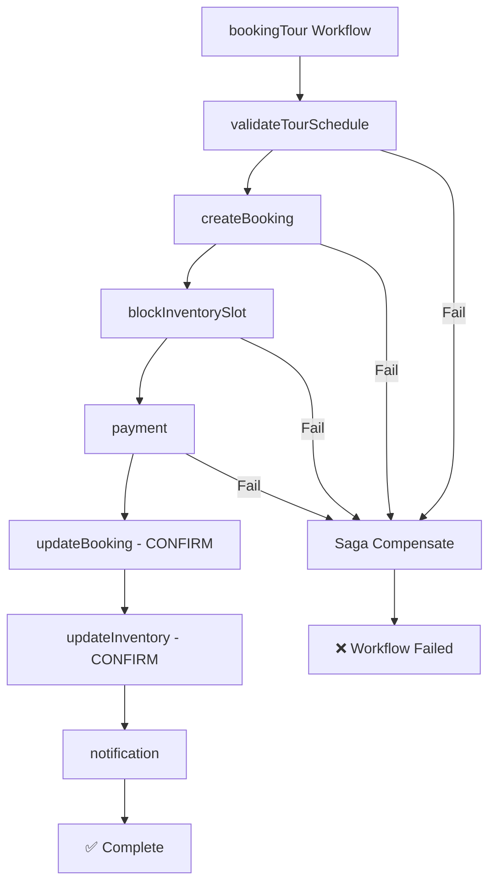

# Booking-Tour Service

> **Task Service / Orchestrator** — Điều phối toàn bộ luồng đặt tour bằng **Temporal.io Workflow** (Saga Pattern). Đây là trung tâm điều phối, không lưu trạng thái nghiệp vụ riêng.

## Thông tin

| Thuộc tính | Giá trị |
|-----------|---------|
| **Port** | `8090` |
| **Tech Stack** | Java 17, Spring Boot 3, Temporal SDK (Java), Spring Web |
| **Database** | ❌ Không có DB riêng (trạng thái lưu trong Temporal Server) |
| **Temporal** | `temporal:7233` (gRPC) |
| **Bảo vệ** | JWT qua Kong Gateway |

---

## Chức năng chính

Booking-Tour Service là **Temporal Workflow Orchestrator** — khi nhận yêu cầu đặt tour, nó khởi động một workflow bất đồng bộ với các bước tuần tự:

```
1. Validate Tour Schedule (Inventory Service)
2. Create Booking (Booking Service) → PENDING_PAYMENT
3. Block Inventory Slots (Inventory Service) → PENDING
4. Process Payment (PayOS via Booking Service)
5. Confirm Booking (Booking Service) → CONFIRMED
6. Update Slot Block (Inventory Service) → CONFIRMED
7. Send Email Notification (Notification Service)
```

**Saga Compensation:** Nếu bất kỳ bước nào thất bại, Temporal tự động rollback các bước trước.

---

## API Endpoints

| Method | Endpoint | Mô tả | Auth |
|--------|----------|-------|------|
| `POST` | `/api/v1/booking-tour/booking` | Khởi tạo workflow đặt tour | ✅ JWT |
| `GET` | `/api/v1/booking-tour/status/{idempotencyKey}` | Kiểm tra trạng thái workflow | ✅ JWT |
| `GET` | `/health` | Health check | ❌ Public |

### Ví dụ: Đặt tour

```bash
curl -X POST http://localhost:8000/api/v1/booking-tour/booking \
  -H "Content-Type: application/json" \
  -H "Authorization: Bearer <JWT_TOKEN>" \
  -d '{
    "accountId": "uuid-...",
    "tourScheduleId": "uuid-...",
    "tourName": "Tour Đà Nẵng - Hội An 3N2Đ",
    "quantity": 2,
    "totalPrice": 5990000,
    "email": "customer@email.com",
    "idempotencyKey": "unique-key-abc123",
    "passengers": [
      {"fullName": "Nguyễn Văn A", "dateOfBirth": "1995-01-15", "passengerType": "ADULT"}
    ]
  }'
```

> Response ngay lập tức `200 OK — "Đã nhận được yêu cầu đặt tour"`. Workflow chạy nền.

### Ví dụ: Kiểm tra trạng thái

```bash
curl http://localhost:8000/api/v1/booking-tour/status/unique-key-abc123 \
  -H "Authorization: Bearer <JWT_TOKEN>"
# → { "workflowId": "Booking-unique-key-abc123", "status": "COMPLETED" }
```

---

## Temporal Workflow

### Workflow ID
```
Booking-{idempotencyKey}
```

**Idempotency:** Nếu cùng `idempotencyKey` được gửi nhiều lần, Temporal đảm bảo chỉ có 1 workflow chạy.

### Task Queue
```
BOOKING_TASK_QUEUE
```

### Activity Timeout
- **Start-To-Close Timeout:** 30 giây mỗi activity
- **Max Attempts:** 3 lần retry nếu lỗi

### Temporal UI

Xem và monitor workflow tại: `http://localhost:8091`

---

## Saga Pattern



---

## Dependencies (Inter-service REST calls)

| Service | Mục đích | Client |
|---------|----------|--------|
| Booking Service | Tạo/xác nhận booking | `BookingClient` |
| Inventory Service | Check/block/confirm slots | `InventoryClient` |
| Document Service | Tạo vé PDF | `DocumentClient` |
| Notification Service | Gửi email xác nhận | `NotificationClient` |

---

## Cấu hình môi trường

| Biến | Mô tả | Default |
|------|-------|---------|
| `SERVER_PORT` | Port service | `8090` |
| `TEMPORAL_URL` | Temporal Server gRPC address | `temporal:7233` |

---

## Chạy local (Docker)

```bash
# Cần khởi động Temporal Server trước
docker compose up --build temporal booking-tour-service
```

## Kiểm tra service

```bash
curl http://localhost:8090/health
```

---

## Cấu trúc package

```
booking_tour_service/
├── activity/
│   ├── BookingTaskActivities.java     # @ActivityInterface
│   └── impl/BookingTaskActivitiesImpl.java
├── client/
│   ├── BookingClient.java
│   ├── InventoryClient.java
│   ├── DocumentClient.java
│   └── NotificationClient.java
├── config/
│   ├── TemporalWorkerConfig.java      # Register workflow & activities
│   └── SecurityConfig.java
├── controller/
│   └── BookingTourController.java
├── dto/
│   ├── request/initiate/             # CreateBookingRequest, SlotBlockRequest, ...
│   ├── request/update/               # ConfirmBookingRequest, EmailRequest, ...
│   └── response/                     # BookingResponse, WorkflowStatusResponse, ...
├── exception/
├── service/
│   └── BookingTriggerService.java    # Query workflow status
└── workflow/
    ├── BookingTaskWorkflow.java       # @WorkflowInterface
    └── impl/BookingTaskWorkflowImpl.java
```

---

> **API Spec đầy đủ:** [`docs/api-specs/booking-tour-service.yaml`](../../docs/api-specs/booking-tour-service.yaml)
